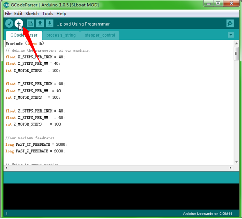

First are explained the meaning of data of the experimentations. Then main results of the experimentation follows. Finaly instructions to run the 2D Plotter are summarized.

###Experimentation

Python files are for the experiment : reception.py, processing.py, kalman.py come from the Kalman-Filter repository (https://github.com/JulienMellet/Kalman-Filter) ; test.py uses the Plotter to draw patterns and save measurements data into a text file ; data_processing.py draws graphs from data collected.

Two experiment have been done to know how change the accuracy with LH positions.

1. Experiment with LH look in the same direction.

data_Kalman_* and data_Madgwick_* are two types of data taken, as showing on the picture, along a line. Filter of LH data use a mean of 4 last data and IMU position is reset at 30 Hz.

2. Experiment with LH look each other.

* Along an almost line (Data ? Data_2 ? Data_3)
	* Oscillations at different amplitudes 
		* 10 cm ? data_2_Kalman_Sin_1
		* 5 cm  ? data_2_Kalman_Sin_2
		* 20 cm ? data_2_Kalman_Sin_3
* Low pass filter 
	* Standard ? Mean of 4 last values
	* 10% of new data ? data_2_filter01_Sin_2
	* 50% of nes data ? data_2_filter05_Sin_2
* IMU
	* Standard ? refresh data at 30 Hz
	* 0,5 s in static ? data_2_IMU05s_static
	* 0,5 s in oscillations ? data_2_IMU05s_Sin_2

###Brief Procedure to run the Plotter

1. Download and install Arduino-1.0.5?http://arduino.cc/en/Main/Software

2. Download the software package and decompress it?https://github.com/Makeblock-official/XY-Plotter-2.0/archive/master.zip

3. Connect Me baseboard to computer with micro USB cable.

4. Open GCodepraser->GCodeParser.ino by Arduino IDE. Click Tools->Serial Ports, choose COM XX (Not COM1 and COM2). Click Tools->Boards, choose Arduino Leonardo. At last, click "upload" button on the right-top corner.
                                                                                  

5. Close Arduino IDE, open GRemoteFull->GRemote.bat. 

6. Set the COM port, then GRemote will show you the UI as follows. That all for this part.

7. Now, you could control the XY-Plotter 2.0 by mouse and keyboard. And, you can also run it with Gcode. You could generate Gcode file by another software (dxf2gcode(https://code.google.com/p/dxf2gcode/) or any other capable). You should save the Gcode file with .cnc and open it by GRemote.

For more details, please refer to the software instruction.

###How to DIY

If you want change the source code, you could find it in GRemotFull/source/GRemote.pde.

1. Download and install Processing-2.1.2. http://processing.org/
2. Install the Processing library, controlP5 -- copy the whole folder to C:\Users\xxx\Documents\Processing\libraries
3. Open the GRemote.pde by Processing, DIY the code and click the “run” button to test it.

(http://www.makeblock.cc/xy-plotter-robot-kit-2-0/)
